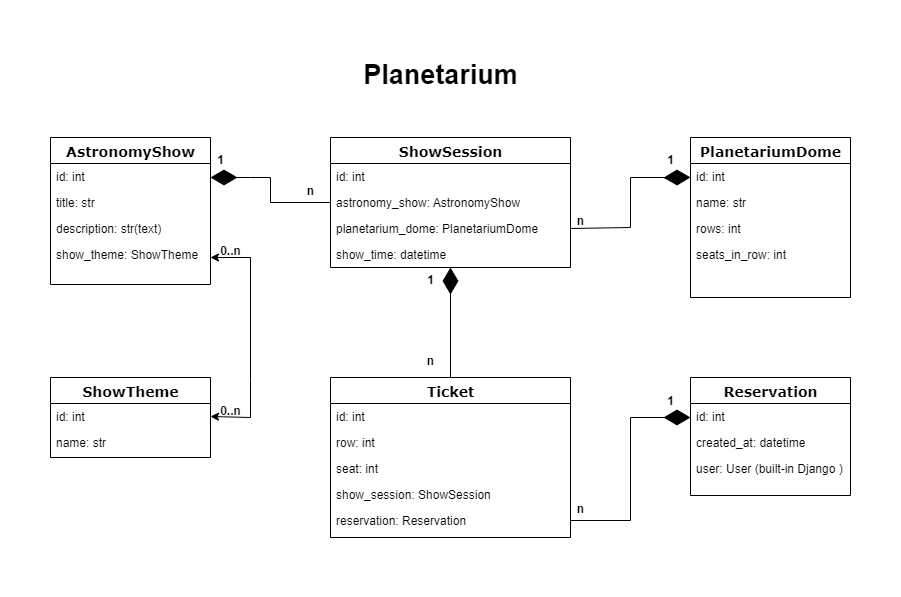

# **Planetarium API Service**

This is a Django project that uses Docker for containerization.

## Contents

- About the Project
- Installation
- Usage
- Contribution
- License
- Contact

## About the Project

This project is created to demonstrate the use of Django with Docker. 
It includes a basic configuration for running a web server and a PostgreSQL database in Docker containers.

## Installation

To install and run this project locally, follow these steps:

1. Clone the repository:
    ```bash
    git clone https://github.com/jyjuk/planetarium-api.git
    cd planetarium-api
    ```

2. Set up the `.env` file:
    - Create a `.env` file using `.env.example` as an example.

3. Build and start the Docker containers:
    ```bash
    docker-compose up --build
    ```

4. Go into the Docker container:
    ```bash
    docker exec -it <container id> sh
    ```

5. Create a superuser:
    ```bash
    python manage.py createsuperuser
    ```

## Usage

After starting the containers, the project will be available at http://localhost:8000.

## Contribution

If you want to contribute to the project, please create a pull request or open an issue on GitHub.

## License

This project is licensed under the MIT License. See the LICENSE file for details.

## Contact

If you have any questions or suggestions, you can contact me at your-email@example.com.

---

DRF project for managing planetarium.

## **Features**:

- JWT authentication.
- Admin panel.
- Documentation for views (go to /api/doc/swagger//).
- CRUD implementation for planetarium.
- Filtering for astronomy shows.



## Contact

**For contact:**

- _Full Name_: Ivan Havrylyshyn
- _Email_: jyjuk1@gmail.com
